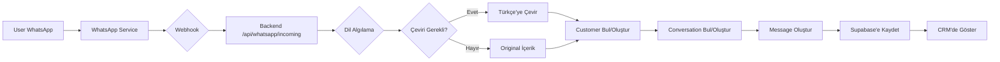
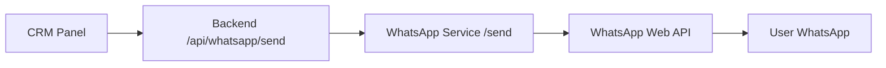

# 📱 WhatsApp CRM Entegrasyonu

## 📖 Genel Bakış

Bu proje, WhatsApp Web API kullanarak gelen mesajları CRM panelinde yönetmenizi sağlar. Mesajlar otomatik olarak müşterilere atanır, dil algılama ve çeviri yapılır.

---

## 🏗️ Mimari

```
┌─────────────┐      ┌──────────────────┐      ┌─────────────┐      ┌──────────┐
│  WhatsApp   │ ───> │ WhatsApp Service │ ───> │   Backend   │ ───> │ Supabase │
│   (User)    │      │   (Node.js)      │      │  (FastAPI)  │      │   (DB)   │
└─────────────┘      └──────────────────┘      └─────────────┘      └──────────┘
                              │                        │
                              │                        │
                              └────────────────────────┘
                                   Webhook (HTTP)
```

### Bileşenler

1. **WhatsApp Service (Node.js)**
   - `whatsapp-web.js` kütüphanesi
   - Puppeteer + Chromium
   - QR authentication
   - Mesaj alma/gönderme
   - Port: 3001

2. **Backend (Python FastAPI)**
   - Webhook handler
   - Dil algılama (langdetect)
   - Otomatik çeviri (deep-translator)
   - CRM entegrasyonu
   - Port: 8000

3. **Supabase**
   - PostgreSQL database
   - Real-time subscriptions
   - REST API

4. **Frontend (Next.js)**
   - CRM arayüzü
   - Real-time mesaj gösterimi
   - Port: 3000

---

## 📁 Dosya Yapısı

```
mlh/
├── whatsapp-service/
│   ├── index.js              # WhatsApp client
│   ├── Dockerfile            # WhatsApp service image
│   ├── package.json
│   └── .env                  # WhatsApp env vars
│
├── backend/
│   ├── routers/
│   │   ├── whatsapp.py       # WhatsApp webhook router
│   │   └── qr_admin.py       # Admin QR endpoint (NEW!)
│   ├── services/
│   │   ├── whatsapp_service.py
│   │   └── ...
│   ├── schemas/
│   │   └── whatsapp.py
│   ├── main.py
│   └── Dockerfile
│
├── docker-compose.yml        # Local development (NEW!)
├── .env.local.example        # Environment template (NEW!)
│
├── scripts/
│   ├── test-whatsapp.sh      # Test script (NEW!)
│   ├── get-whatsapp-qr.sh    # QR retrieval (NEW!)
│   └── send-test-message.sh  # Send test message (NEW!)
│
└── docs/
    ├── WHATSAPP_QUICKSTART.md          # Hızlı başlangıç (NEW!)
    ├── WHATSAPP_DEPLOYMENT_GUIDE.md    # Detaylı guide (NEW!)
    └── COOLIFY_WHATSAPP_SETUP.md       # Coolify deployment (NEW!)
```

---

## 🚀 Hızlı Başlangıç

### Lokal Geliştirme (Docker Compose)

```bash
# 1. Environment variables
cp .env.local.example .env.local
# Supabase bilgilerini doldur

# 2. Servisleri başlat
docker-compose up -d

# 3. WhatsApp'ı bağla
# Windows:
curl http://localhost:3001/qr
# Linux/Mac:
./scripts/get-whatsapp-qr.sh

# 4. Test et
curl http://localhost:3001/status
./scripts/test-whatsapp.sh
```

**Detaylı:** `WHATSAPP_QUICKSTART.md`

---

### Production (Coolify)

1. **Backend deploy et** (önce!)
2. **WhatsApp service deploy et**
3. **Persistent volume ekle** (`/app/data`)
4. **QR kod oku**
5. **Test et**

**Detaylı:** `COOLIFY_WHATSAPP_SETUP.md`

---

## 🔌 API Endpoints

### WhatsApp Service (Port 3001)

| Endpoint | Method | Açıklama |
|----------|--------|----------|
| `/health` | GET | Health check |
| `/status` | GET | WhatsApp bağlantı durumu |
| `/qr` | GET | QR kod al |
| `/send` | POST | Mesaj gönder |

### Backend (Port 8000)

| Endpoint | Method | Açıklama | Auth |
|----------|--------|----------|------|
| `/api/whatsapp/incoming` | POST | Webhook (WhatsApp → Backend) | Token |
| `/api/whatsapp/send` | POST | Mesaj gönder | - |
| `/api/whatsapp/health` | GET | WhatsApp entegrasyon durumu | - |
| `/api/admin/whatsapp/qr` | GET | QR kod al (admin) | Bearer |
| `/api/admin/whatsapp/status` | GET | Status (admin) | Bearer |

---

## 🔐 Güvenlik

### Webhook Authentication

Environment variables:
```env
WEBHOOK_TOKEN=your_secure_random_token
```

WhatsApp Service → Backend:
```
Authorization: Bearer <WEBHOOK_TOKEN>
```

### Admin Endpoints

QR ve status endpoint'leri admin token gerektirir:
```bash
curl -H "Authorization: Bearer <ADMIN_TOKEN>" \
  https://backend-mlh.heni.com.tr/api/admin/whatsapp/qr
```

**Önemli:** Production'da `ADMIN_TOKEN` ve `WEBHOOK_TOKEN` değiştirin!

---

## 📊 Mesaj Akışı

### Gelen Mesaj (WhatsApp → CRM)



### Giden Mesaj (CRM → WhatsApp)



---

## 🛠️ Teknik Detaylar

### WhatsApp Service Dependencies

```json
{
  "whatsapp-web.js": "^1.23.0",  // WhatsApp Web API
  "puppeteer": "^21.x",          // (indirect) Headless Chrome
  "express": "^4.18.2",          // HTTP server
  "axios": "^1.6.7"              // HTTP client
}
```

### Backend Dependencies

```txt
fastapi
httpx                 # Async HTTP (WhatsApp service iletişimi)
langdetect           # Dil algılama
deep-translator      # Çeviri (Google Translate)
supabase             # Supabase client
```

### Session Storage

WhatsApp auth session:
- **Konum:** `/app/data` (container içinde)
- **Format:** Binary files (Chrome profile)
- **Persistence:** Volume mount gerekli!
- **Boyut:** ~50-100MB

---

## 🧪 Test Senaryoları

### 1. Health Check

```bash
curl http://localhost:3001/health
# Expected: {"status": "ok", "whatsapp": {"ready": true}}
```

### 2. WhatsApp Bağlantısı

```bash
curl http://localhost:3001/status
# Expected: {"connected": true, "hasQR": false}
```

### 3. Mesaj Gönderme

```bash
curl -X POST http://localhost:3001/send \
  -H "Content-Type: application/json" \
  -d '{"to":"905551234567","message":"Test"}'
# Expected: {"success": true, "messageId": "..."}
```

### 4. Webhook Test

```bash
# WhatsApp Service → Backend
curl -X POST http://localhost:8000/api/whatsapp/incoming \
  -H "Content-Type: application/json" \
  -H "Authorization: Bearer your_token" \
  -d '{
    "channel": "whatsapp",
    "from_phone": "905551234567",
    "from_name": "Test User",
    "content": "Hello",
    "message_id": "test123",
    "timestamp": 1234567890
  }'
```

---

## 🐛 Sorun Giderme

### "WhatsApp client is not ready"

**Sebep:** QR okutulmamış
**Çözüm:** QR kodu al ve oku

```bash
curl http://localhost:3001/qr
```

### "Failed to launch browser"

**Sebep:** Chromium dependencies eksik
**Çözüm:** Dockerfile'da tüm dependencies var mı kontrol et

### "ECONNREFUSED" (Webhook)

**Sebep:** Backend'e erişilemiyor
**Çözüm:**
1. Network connectivity kontrol et
2. `BACKEND_URL` environment variable kontrol et
3. Backend çalışıyor mu kontrol et

### Session kayboluyor

**Sebep:** Persistent volume yok
**Çözüm:** Volume mount ekle (`/app/data`)

**Daha fazla:** `WHATSAPP_DEPLOYMENT_GUIDE.md` → Sorun Giderme bölümü

---

## 📈 Performans

### Kaynaklar

- **CPU:** 0.5-1 core (Puppeteer + Chromium)
- **RAM:** 512MB - 1GB
- **Disk:** ~500MB (image) + ~100MB (session)
- **Network:** Minimal (webhook calls)

### Ölçeklenebilirlik

- **Concurrent messages:** ~10-50/second
- **Bottleneck:** WhatsApp Web rate limits
- **Çözüm:** Message queue (gelecek)

---

## 🔄 Gelecek İyileştirmeler

- [ ] Message queue (RabbitMQ/Redis)
- [ ] Webhook retry mechanism
- [ ] CRM panel'de QR gösterimi
- [ ] Grup mesajları desteği
- [ ] Medya mesajları (resim, video)
- [ ] Message templates
- [ ] Bulk messaging
- [ ] Analytics dashboard

---

## 📚 Dokümantasyon

- **Hızlı Başlangıç:** `WHATSAPP_QUICKSTART.md`
- **Deployment Guide:** `WHATSAPP_DEPLOYMENT_GUIDE.md`
- **Coolify Setup:** `COOLIFY_WHATSAPP_SETUP.md`
- **Backend Deployment:** `BACKEND_DEPLOYMENT.md`

---

## 📞 Destek

Sorun yaşıyorsanız:

1. İlgili dokümantasyonu okuyun
2. Logs kontrol edin (`docker-compose logs -f`)
3. Health endpoint'leri test edin
4. Test script'lerini çalıştırın (`./scripts/test-whatsapp.sh`)

---

## ⚠️ Önemli Notlar

1. **WhatsApp ToS:** WhatsApp resmi olarak bot kullanımını desteklemiyor. Dikkatli kullanın.
2. **Rate Limits:** WhatsApp Web rate limit uygular, aşırı mesaj göndermeyin.
3. **Session:** QR okutmadan önce volume mount'u ayarlayın, yoksa her restart'ta QR istersiniz.
4. **Security:** Production'da mutlaka token'ları değiştirin!

---

## 📝 Lisans & Yasal

- `whatsapp-web.js` unofficial bir kütüphanedir
- WhatsApp ban riski vardır
- Commercial use için WhatsApp Business API kullanın
- Bu proje educational/internal use içindir

---

## 🎉 Başarılı Kurulum!

Eğer bu adımları tamamladıysanız:
✅ WhatsApp mesajları CRM'de görünüyor
✅ Otomatik dil algılama ve çeviri çalışıyor
✅ Müşteriler otomatik oluşturuluyor
✅ Real-time bildirimler aktif

Tebrikler! 🎊
